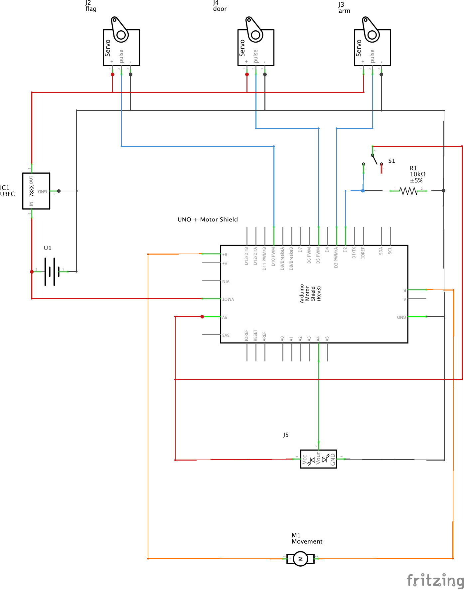

# Useless Box
A useless box is basically a machine which turns itself off. However, with a few additional servos, and a little programming, you're able to blow some live into it and give it some "character" - as well as adding a few surprises for the user...

## TL;DR 

A demo video of the box. Because of the randomized behaviour the video doesn't include _all_ different behaviour patterns - there are more...

 quite a bit.

## Hardware

### Electronics - Parts List

The following parts were used:

| Amount | Part Type | Properties |
|--------|-----------|------------|
| 1 | [Arduino Uno](https://www.arduino.cc/en/Main/arduinoBoardUno) | |
| 1 | [MotorShield](https://www.arduino.cc/en/Main/ArduinoMotorShieldR3) | Rev3 |
| 2 | Basic Servo | You should use a high-torque servo for the arm |
| 1	| Micro Servo | |
| 1	| Infrared Proximity Sensor [Sharp GP2Y0A21YK0F](http://www.sharpsma.com/webfm_send/1489) | 10 - 80 cm |
| 1	| DC Motor | geared |
| 1 | Metallic Toggle Switch | |
| 1 | Plastic Power Switch | |
| 1 | LIPO Battery | 11.1v 1200mAh |
| 1 | Resistor | 10k&#937; Pull-down for switch |
| 2 | [NeoPixel](https://www.adafruit.com/category/168) | |
| 1 | 5V UBEC DC-DC Converter | UBEC 5A Dynam DY-1016-5A |

### Circuit

### Material

* Wooden box with enough space to fit everything into
* Some chipboard ~ 4mm to build the arm and mountings
* Rubber band to force-close the lid
* Hinges
* Cables

### Tools

* Solder
* Jigsaw
* Sanding paper
* Wood glue

## Operation

My useless box fulfills of course the basic functionality of turning itself off.
But using a few additional pieces of equipment it can:

* "Hop" away
* Detect the users distance (and react to it)
* Wave a white flag - but without giving up of course :)

# Software

The box has basically a fixed set of "moves" it can do to turn of the switch after it has been turned on. To make things a little more interesting, the moves are randomly used to surprise the operator.

The whole code is quite easy - there's nothing special about it.
I've created a few bases classes to control every peripheral and another class "Moves" to implement the patterns. This is mainly because the basic Arduino way of programming leads to lots of code duplication and unreadable code.
